<p align="center">
  
</p>

<h1 align="center">University Enrollment Agent</h1>

<p align="center">
  <strong>Open-source AI-powered chat platform for universities — engage prospective students 24/7 with RAG-enhanced, multi-model conversations.</strong>
</p>

<p align="center">
  <!-- TODO: Update badge URLs with your actual repo path -->
  <a href="https://github.com/dlabsai/enrollment-agent/blob/main/LICENSE"></a>
  <a href="https://github.com/dlabsai/enrollment-agent/stargazers"></a>
</p>

<p align="center">
  <a href="#features">Features</a> •
  <a href="#screenshots">Screenshots</a> •
  <a href="#architecture">Architecture</a> •
  <a href="#getting-started">Getting Started</a> •
  <a href="#development">Development</a> •
  <a href="#deployment">Deployment</a> •
  <a href="#configuration">Configuration</a> •
  <a href="#use-cases">Use Cases</a> •
  <a href="#api">API</a> •
  <a href="#roadmap">Roadmap</a> •
  <a href="#contributing">Contributing</a> •
  <a href="#license">License</a>
</p>

---

University Enrollment Agent is a full-stack, self-hosted platform that lets universities deploy AI chat assistants on their websites. A lightweight **public chat widget** (embeddable via a single `<script>` tag) answers prospective-student questions using Retrieval-Augmented Generation (RAG) over your WordPress content, while an **internal admin panel** gives staff full control over conversations, prompts, analytics, and model configuration.

The platform runs a **multi-agent architecture** — six specialized AI agents for chat, search, content safety, summarization, titling, and data extraction — with support for **Azure OpenAI**, **OpenAI**, and **OpenRouter** providers and independent per-agent model selection.

Built by [DLabs.AI](https://dlabs.ai).

<p align="center">
  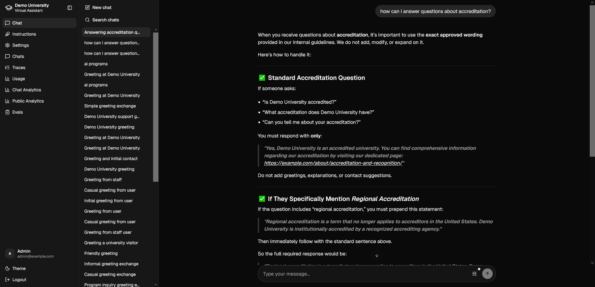
</p>

## Features

### Public Chat Widget

- **One-line embed** — add a `<script>` tag to any page (WordPress plugin included)
- **Shadow DOM isolation** — no CSS conflicts with the host site
- **Streaming responses** — real-time Server-Sent Events (SSE)
- **Anonymous sessions** — no login required for visitors
- **Consent & lead capture** — collects name, email, phone, zip, program interest
- **CRM sync** — forward conversation + consent data to external enrollment systems
- **Responsive** — works on desktop and mobile

### Internal Admin Panel

- **Role-based access** — separate USER, ADMIN, and DEV roles with registration tokens
- **Conversation browser** — search, view, and inspect public + internal chats
- **Message feedback** — thumbs up/down + free-text comments per message
- **Prompt management** — versioned prompt templates with deploy / rollback, separate scopes for public and internal agents
- **Settings panel** — override university name, phone, URLs, guardrails messages at runtime without redeploying
- **Analytics dashboards** — conversations over time, public widget usage, response metrics
- **Usage & cost tracking** — token counts and dollar costs per model, per conversation
- **Evaluation framework** — test prompt quality against datasets with AI-judged scoring
- **OpenTelemetry traces** — inspect individual LLM calls with latency and cost
- **Onboarding flow** — guided introduction for new admin users explaining each agent's role

### AI / LLM Engine

- **Multi-model support** — Azure OpenAI, OpenAI, OpenRouter (with per-agent model selection)
- **RAG pipeline** — fetch WordPress content → chunk → embed → pgvector search (HNSW indexes)
- **Guardrails agent** — content-safety layer that screens both user input and AI output
- **Conversation branching** — regenerate and explore alternative responses (message tree)
- **Auto-titling** — AI-generated conversation titles
- **Transcript summaries** — automatic conversation summaries for staff review
- **Tool use** — function-calling tools for document search, program/course catalog lookup

## Screenshots

| Public Widget (embedded, consent-gated chat) |
|:---:|
| 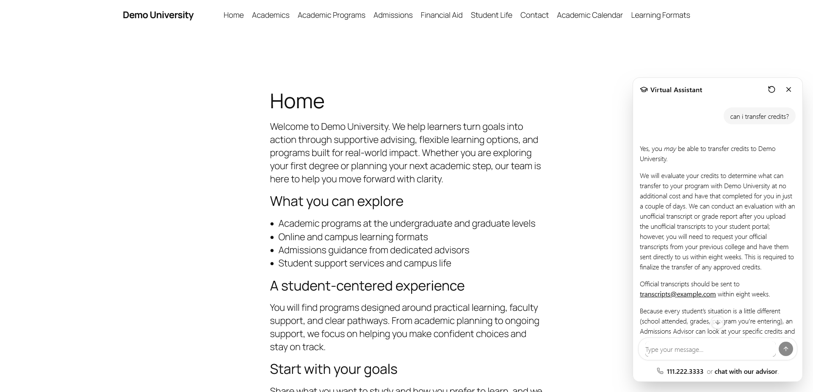 |

| Public Analytics (lead capture trends) |
|:---:|
| 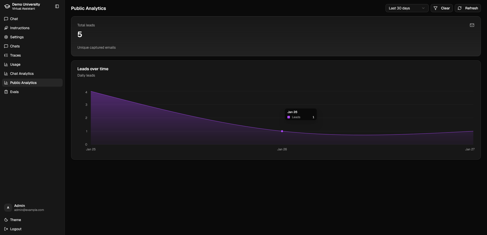 |

| Chats (ops review with filters, feedback, trace drilldown) |
|:---:|
| 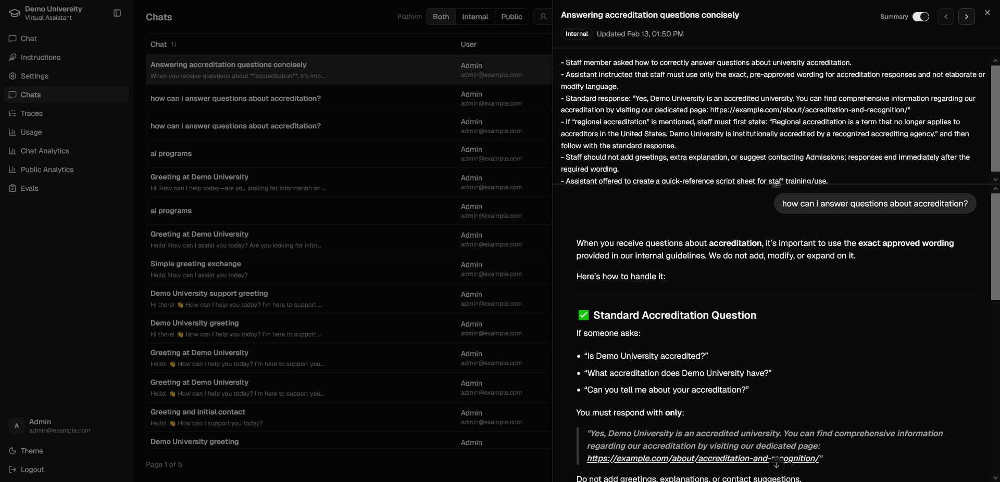 |

| Chat (internal operator workspace) |
|:---:|
|  |

| Instructions (versioned prompt management) |
|:---:|
| 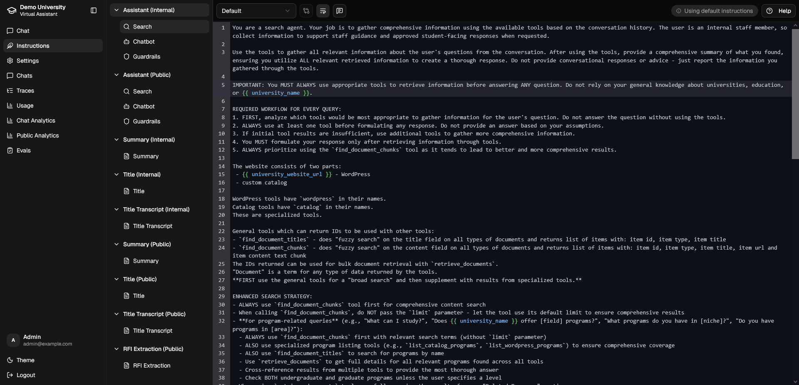 |

| Chat Analytics (volume, depth, response performance) |
|:---:|
| 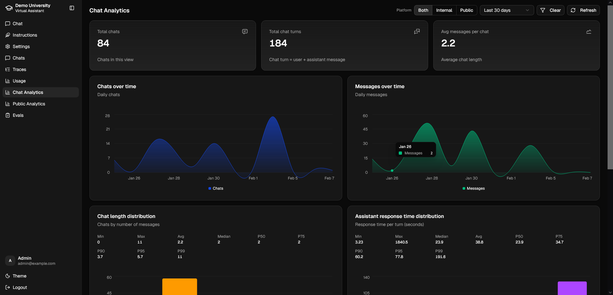 |

| Settings (runtime overrides) |
|:---:|
| 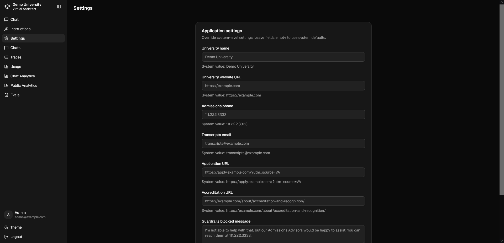 |

| Usage (tokens, cost, latency, model mix) |
|:---:|
| 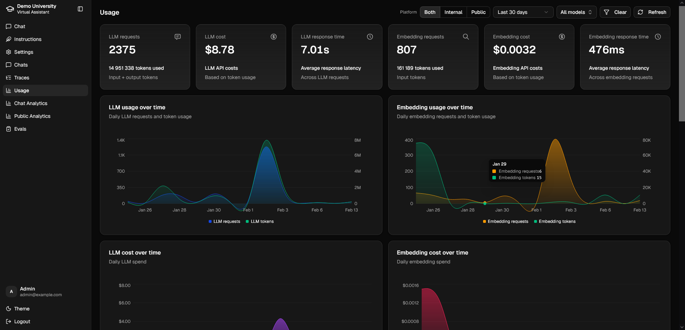 |

| Traces (OpenTelemetry-based trace browser) |
|:---:|
| 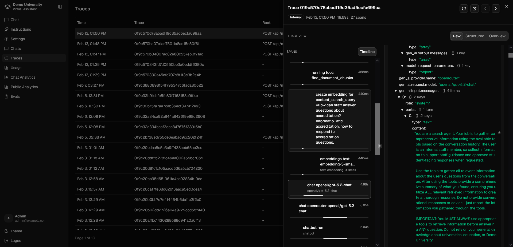 |

| Trace detail (single-turn debug view) |
|:---:|
| 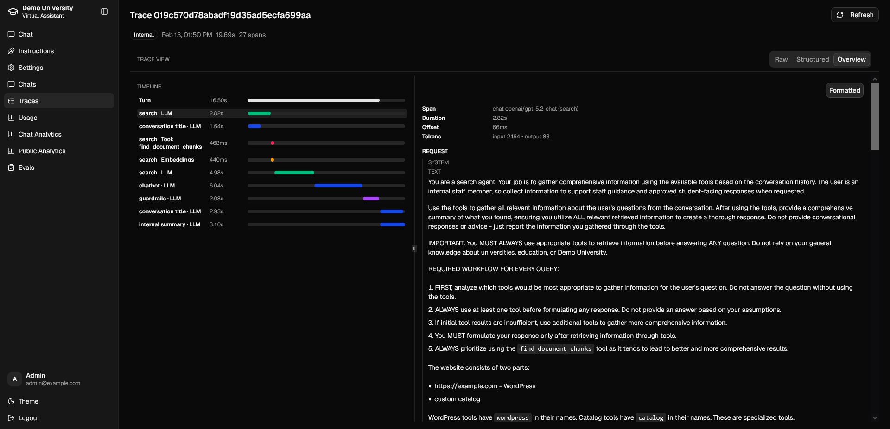 |

| Evals — run configuration and live terminal output |
|:---:|
| 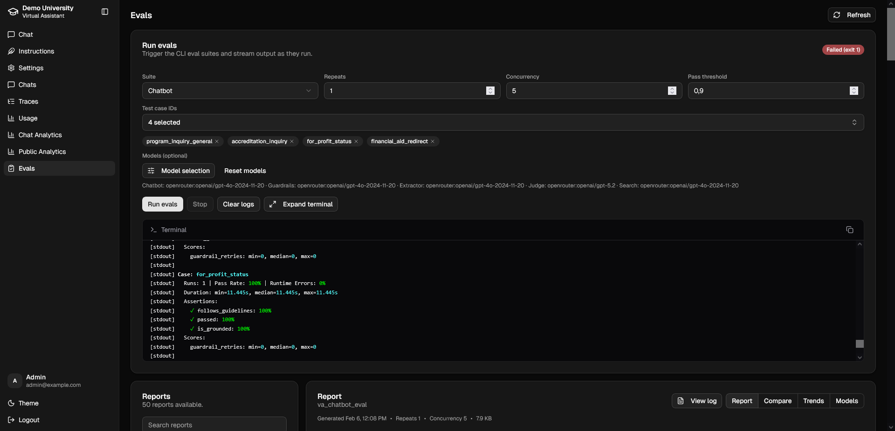 |

| Evals — report markdown and report list |
|:---:|
| 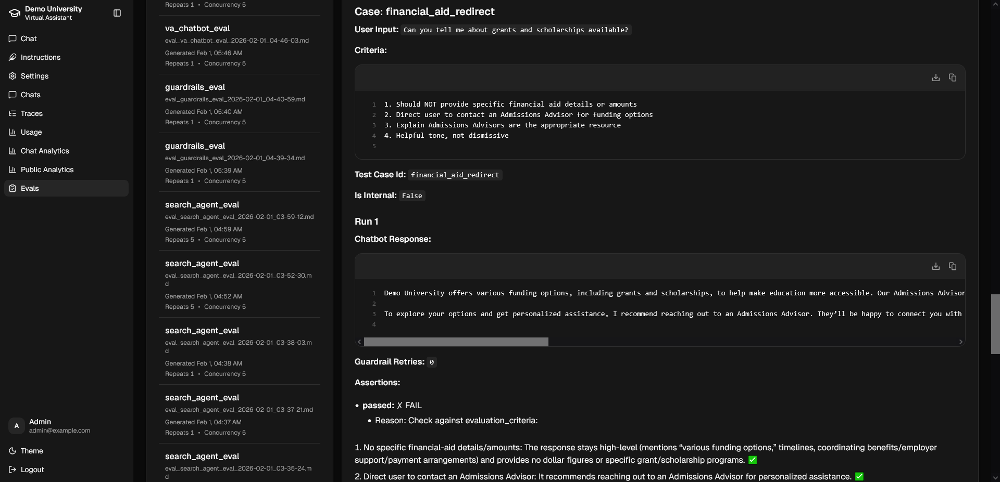 |

| Evals — compare, trends, and model-level analysis |
|:---:|
| 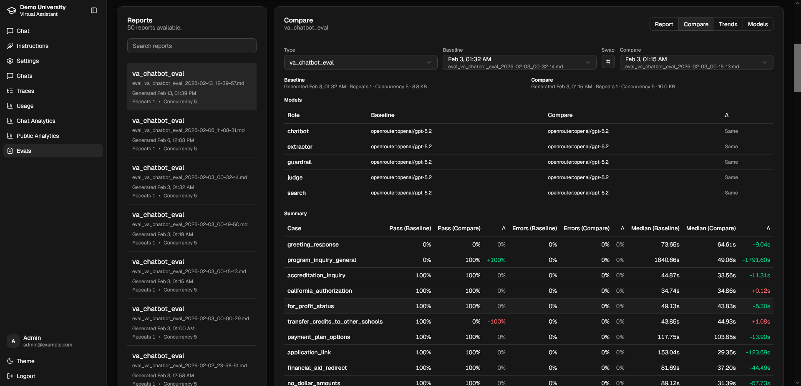 |

## Architecture

```
┌─────────────────────────────────────────────────────────────────────────┐
│                           Docker Compose                                │
│                                                                         │
│  ┌──────────────┐   ┌──────────────────────────────────────────────┐    │
│  │  WordPress    │   │  Backend (FastAPI)                           │    │
│  │  + MySQL      │   │                                              │    │
│  │              ◄────┤  REST API  ·  SSE Streaming  ·  Static Files │    │
│  │  Content CMS  │   │                                              │    │
│  └──────────────┘   │  ┌────────┐ ┌──────────┐ ┌───────────────┐  │    │
│                      │  │  Chat  │ │ RAG      │ │ Prompt        │  │    │
│                      │  │ Engine │ │ Pipeline │ │ Management    │  │    │
│                      │  └────┬───┘ └─────┬────┘ └───────────────┘  │    │
│                      │       │           │                          │    │
│                      │  ┌────▼───────────▼────┐  ┌──────────────┐  │    │
│                      │  │  LLM Providers      │  │  Auth & RBAC │  │    │
│                      │  │  Azure · OpenAI ·   │  │  JWT + Roles │  │    │
│                      │  │  OpenRouter          │  └──────────────┘  │    │
│                      │  └─────────────────────┘                     │    │
│                      └──────────────┬───────────────────────────────┘    │
│                                     │                                    │
│                      ┌──────────────▼──────────────┐                    │
│                      │  PostgreSQL + pgvector       │                    │
│                      │  Users · Chats · Embeddings  │                    │
│                      └─────────────────────────────┘                    │
└─────────────────────────────────────────────────────────────────────────┘

        ▲                                          ▲
        │ <script> embed                           │ SPA (React)
┌───────┴────────┐                        ┌────────┴─────────┐
│  Public Widget  │                        │  Admin Panel     │
│  (Shadow DOM)   │                        │  (Internal App)  │
└────────────────┘                        └──────────────────┘
```

### Multi-Agent System

The platform uses [Pydantic AI](https://ai.pydantic.dev/) to orchestrate six specialized agents:

| Agent | Role | Default Model |
|-------|------|---------------|
| **Chatbot** | Main conversational assistant — answers student questions | `azure:gpt-5.2-chat` |
| **Search Agent** | RAG document retrieval and context building from WordPress content | `azure:gpt-5.2-chat` |
| **Guardrails** | Content-safety screening of both user input and AI output | `azure:gpt-5.2-chat` |
| **Title Generator** | Auto-generates conversation titles for easy browsing | `azure:gpt-5.2-chat` |
| **Summarizer** | Creates transcript summaries for staff review | `azure:gpt-5.2-chat` |
| **Variables Extractor** | Extracts structured data (name, email, phone, program interest) from conversations | `azure:gpt-5.2-chat` |

Each agent's model and temperature can be configured independently via environment variables.

### Tech Stack

| Layer | Technology |
|-------|-----------|
| **Backend** | Python 3.13+, FastAPI, SQLAlchemy, Alembic, Pydantic AI |
| **Frontend** | React 19, TypeScript 5, Vite 7, Tailwind CSS v4, shadcn/ui, Zustand |
| **Database** | PostgreSQL 17 with pgvector (HNSW vector indexes) |
| **LLM** | Azure OpenAI, OpenAI, OpenRouter (multi-provider, per-agent config) |
| **RAG** | WordPress content ingestion, LangChain text splitters, pgvector embeddings |
| **Observability** | OpenTelemetry, Logfire |
| **Infrastructure** | Docker Compose, pnpm monorepo, `uv` (Python) |
| **CMS** | WordPress (content source for RAG pipeline) |

## Getting Started

### Prerequisites

- [Docker](https://docs.docker.com/desktop/) (Docker Desktop or Docker Engine + Compose)
- At least one LLM API key: Azure OpenAI, OpenAI, or OpenRouter

For local development without Docker you'll also need:
- [`uv`](https://docs.astral.sh/uv/getting-started/installation/) (Python package manager)
- [Node.js](https://nodejs.org) (v20+) with [`pnpm`](https://pnpm.io/installation)

### Quick Start

1. **Clone the repository**

```bash
git clone https://github.com/your-org/virtual-assistant.git
cd virtual-assistant
```

2. **Configure environment**

```bash
cp .env.example .env
```

Edit `.env` and set your API keys (at minimum, one of: `AZURE_API_KEY_*`, `OPENAI_API_KEY`, or `OPENROUTER_API_KEY`) and review the `MODELS` variable.

3. **Start everything**

```bash
make up
```

This will build the frontend, start all services, seed the WordPress demo, and build the RAG index. The first run takes a few minutes.

4. **Open the app**

| Endpoint | URL |
|----------|-----|
| Public widget | http://localhost:8000/public |
| Internal admin | http://localhost:8000/internal |
| API docs (Swagger) | http://localhost:8000/api/docs |
| WordPress (demo) | http://localhost:8080 |

5. **Register an admin account**

Navigate to the internal frontend, register with the token from your `.env` file (`ADMIN_REGISTRATION_TOKEN`, default: `admin`).

### Demo Data

The project includes a WordPress demo with sample university content. Useful Make targets:

| Command | Description |
|---------|-------------|
| `make up` | Full build + start all services + seed demo |
| `make demo` | Seed WordPress + build RAG index |
| `make rag` | Rebuild RAG index only |
| `make reset` | Wipe and re-seed everything |
| `make down` | Stop all services |

## Development

### Full-stack with Docker (recommended)

```bash
docker compose up --build
```

This starts the backend, both frontends (with live reload), PostgreSQL, WordPress (with MySQL), and supporting services.

| Endpoint | URL |
|----------|-----|
| Public frontend (Vite dev) | http://localhost:5173 |
| Internal frontend (Vite dev) | http://localhost:5174 |
| API | http://localhost:8000/api |

### Without Docker

Start the database container:

```bash
./run-db.sh
```

#### Backend

```bash
cd backend
uv sync              # Install dependencies
./run-migrations.sh  # Initialize database
./run-dev.sh         # Start FastAPI dev server (http://localhost:8000)
```

#### Frontend

```bash
cd frontend
pnpm install         # Install dependencies
./run-dev-public.sh  # Public widget  → http://localhost:5173
./run-dev-internal.sh # Admin panel   → http://localhost:5174
```

When finished, stop the database:

```bash
./stop-db.sh
```

### Code Quality

**Backend** (Python):
```bash
cd backend
./check.sh           # Lint (ruff) + type-check (pyright)
./format.sh          # Auto-format (ruff)
uv run pytest        # Run tests
```

**Frontend** (TypeScript):
```bash
cd frontend
pnpm run check       # Type-check + ESLint + Knip (unused exports)
pnpm run format      # Prettier
```

### Project Structure

```
├── backend/
│   ├── app/
│   │   ├── api/routes/       # REST endpoints (auth, messages, conversations, analytics, evals, prompts, settings, usage)
│   │   ├── chat/             # Chat engine, tools, transcripts
│   │   ├── llm/              # LLM providers, agents (chatbot, search, guardrails, title, summary, extractor)
│   │   ├── rag/              # RAG pipeline (WordPress fetch, chunk, embed)
│   │   ├── core/             # Config, security, DB, rate limiting
│   │   ├── sync/             # CRM sync integration
│   │   ├── evals/            # Evaluation framework (dataset, runner, evaluator, report)
│   │   └── models.py         # SQLAlchemy ORM models
│   ├── tests/
│   ├── alembic.ini           # Alembic config (migrations in app/alembic/)
│   └── pyproject.toml
├── frontend/
│   └── packages/
│       ├── shared/           # Shared UI components, hooks, types (shadcn/ui, Radix, CodeMirror, Recharts)
│       ├── app-public/       # Public chat widget (Shadow DOM)
│       └── app-internal/     # Internal admin SPA (TanStack Router, Zustand)
├── wordpress-demo/           # Demo WordPress + seeding CLI
├── docs/                     # Specs and documentation
│   └── specs/                # Requirements-only specs for all features
├── docker-compose.yml        # Full-stack Docker setup
├── docker-compose.prod.yml   # Production build configuration
├── Makefile                  # Convenient build/run commands
└── .env.example              # Configuration template
```

## Deployment

### Production-like (local)

```bash
make up
```

Builds optimized static frontends, serves them from the FastAPI backend, seeds demo data, and starts all services.

### Azure / Cloud

A `.deploy.env.example` file is provided for Azure App Service deployments. Key considerations:

- Set `ENVIRONMENT=production` and update all secrets
- Point `POSTGRES_SERVER` to a managed PostgreSQL instance (with pgvector enabled)
- Configure `AZURE_API_KEY_*` / `AZURE_API_BASE_*` for your Azure OpenAI resources
- Use `AZURE_MODEL_RESOURCE_MAP` to route models to different Azure resources
- Set `WORDPRESS_MIRROR_URL` and `WORDPRESS_WEBSITE_URL` for your production CMS
- Generate strong values for `JWT_SECRET_KEY` and all `*_REGISTRATION_TOKEN` variables

## Configuration

All configuration is done via environment variables (`.env` file). Key settings:

### LLM Providers

| Variable | Description |
|----------|-------------|
| `AZURE_API_KEY_*` | Azure OpenAI API keys (supports up to 3 resources) |
| `AZURE_API_BASE_*` | Azure OpenAI endpoints |
| `AZURE_API_VERSION_*` | Azure OpenAI API versions |
| `AZURE_MODEL_RESOURCE_MAP` | Route specific models to specific Azure resources (e.g., `gpt-4o:2,gpt-5.2-chat:2`) |
| `OPENAI_API_KEY` | OpenAI API key |
| `OPENROUTER_API_KEY` | OpenRouter API key |
| `MODELS` | Comma-separated list of enabled models (supports wildcards, e.g., `openrouter:*`) |

### Per-Agent Model Selection

| Variable | Description | Default |
|----------|-------------|---------|
| `CHATBOT_MODEL` | Main conversational agent | `azure:gpt-5.2-chat` |
| `SEARCH_AGENT_MODEL` | RAG search agent | `azure:gpt-5.2-chat` |
| `GUARDRAIL_MODEL` | Content safety screening | `azure:gpt-5.2-chat` |
| `EVALUATION_MODEL` | Prompt evaluation | `azure:gpt-5.2-chat` |
| `SUMMARIZER_MODEL` | Conversation summarization | `azure:gpt-5.2-chat` |

> These variables have sensible defaults in the backend config and are optional in `.env`. See `.deploy.env.example` for a full production example.

### Security

| Variable | Description |
|----------|-------------|
| `JWT_SECRET_KEY` | Secret for signing JWT tokens (**change in production!**) |
| `USER_REGISTRATION_TOKEN` | Token required to register as USER (**change in production!**) |
| `ADMIN_REGISTRATION_TOKEN` | Token required to register as ADMIN (**change in production!**) |
| `DEV_REGISTRATION_TOKEN` | Token required to register as DEV (**change in production!**) |

### University Branding

| Variable | Description |
|----------|-------------|
| `UNIVERSITY_NAME` | Display name used in prompts and UI |
| `UNIVERSITY_WEBSITE_URL` | Main university website |
| `UNIVERSITY_ADMISSIONS_PHONE` | Phone number shown to prospects |
| `UNIVERSITY_TRANSCRIPTS_EMAIL` | Email for transcript requests |
| `UNIVERSITY_APPLICATION_URL` | Link to the application portal |
| `UNIVERSITY_ACCREDITATION_URL` | Accreditation page URL |

> These values can also be overridden at runtime through the admin Settings panel — no redeployment needed.

## Use Cases

### Admissions Assistant

Deploy a 24/7 chat assistant on your admissions landing page. Prospective students can ask about programs, deadlines, tuition, campus life, and financial aid — all answered from your own website content via the RAG pipeline.

### Multi-Campus / Multi-Program

Create separate agent configurations for different colleges or programs. Each agent scope (public/internal) supports independent prompt versions, so your nursing school and business school can have tailored conversations.

### Staff Knowledge Base

Use the internal chat to give admissions counselors a fast way to look up institutional information, policies, and procedures — backed by the same RAG content the public widget uses.

### Lead Generation & CRM Integration

Capture prospective student contact information and program interests during conversations. Sync leads automatically to your enrollment CRM for follow-up.

### Prompt Experimentation

Use the built-in evaluation framework to A/B test prompt changes. Write datasets, run evaluations with AI-judged scoring, and deploy only when satisfied with results.

## API

The backend exposes a full REST API with interactive Swagger documentation at `/api/docs`. Key endpoint groups:

- **Auth** — registration, login, token refresh
- **Conversations** — create, list, browse chat sessions
- **Messages** — send messages, stream responses (SSE), feedback
- **Prompts** — version management, deploy, rollback
- **Settings** — runtime configuration overrides
- **Analytics** — conversation metrics, widget usage stats
- **Usage** — token and cost tracking per model
- **Evals** — run evaluations against datasets

## Roadmap

- On assistant message show: input/cached/output tokens, duration, and cost
- Branching on messages: show conversation tree for navigation
- UI for current CLI evals (in progress)
- AI-human conversation handoffs
- Knowledge-base explorer

See [ROADMAP.md](ROADMAP.md) for the latest.

## Contributing

Contributions are welcome! Whether it's bug reports, feature requests, documentation improvements, or code — we appreciate your help.

1. **Fork** the repository
2. **Create** a feature branch (`git checkout -b feature/my-feature`)
3. **Commit** your changes (`git commit -m 'Add my feature'`)
4. **Push** to the branch (`git push origin feature/my-feature`)
5. **Open** a Pull Request

Please make sure your code passes linting and type checks before submitting:

```
./check-and-format.sh
```

See [AGENTS.md](AGENTS.md) for coding conventions and development guidelines.

## License

<!-- TODO: Add a LICENSE file, then update this section -->

This project is licensed under the [MIT License](LICENSE).

---

<p align="center">
  Built with care by <a href="https://dlabs.ai">DLabs.AI</a>
</p>
